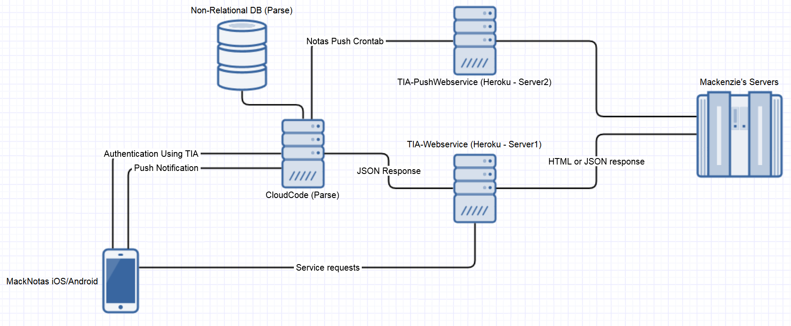

<h3 align="center">
  
</h3>

docs
============

`MackNotas` foi um projeto criado por alunos da Universidade Mackenzie de forma não-oficial, que permite acesso rápido as principais informações do TIA (Terminal Informativo Academico).

O projeto foi encerrado em Dezembro de 2016, bem como todos seus serviços desligados em Janeiro de 2017.

O que compõe?
============
O produto `MackNotas` é composto por:
  - iOS
  - Android
  - Servidor Core (TIA-Webservice)
  - Servidor Push (TIA-PushWebservice)
  
Quais serviços estão disponíveis?
============
Os serviços disponíveis são:
  - Notas
  - Grade Horária
  - Faltas
  - Calendário do TIA
  - Calendário do Moodle
  - Atividades Complementares
  - Desempenho Academico (Android apenas)
  - Push Notification para novas notas

Arquitetura Cloud
============
A arquitetura dos servidores do `MackNotas` é composta da seguinte forma:
  - CloudCode (Parse)
  - TIA-WebService (Heroku server1)
  - TIA-PushWebservice (Heroku server2)
  - Non-Relational Database (Parse)

A forma como esses servidores são conectados podem ser visualizados no diagrama a seguir:

Todas as requisições de autenticação passam apenas para o `CloudCode`, que as encaminha (se necessário) para o `TIA-Webservice` que autentica com o `Servidor do Mackenzie`.

Após autenticado com sucesso, as demais requisições são feitas diretamente no `TIA-Webservice`.

A crontab de push notification de novas notas é feita pelo `CloudCode` que obtém as novas notas através do `TIA-PushWebservice`. Leia mais sobre LINK e LINK.
